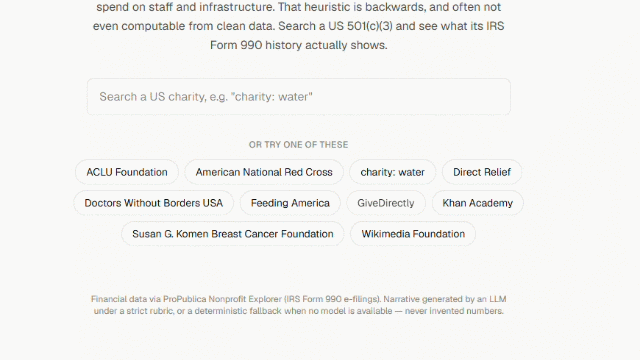

# GlassPocket — Overhead Myth Buster

**Live:** [glasspocket.vercel.app](https://glasspocket.vercel.app/)
**Category:** Overall Winner + Best Use of Google AI (Gemini-powered narrative generator and chat)

## The Hook
Most charity-rating tools reinforce the harmful "overhead ratio" myth. This contrarian tool argues
against that dominant heuristic by reframing efficiency around outcomes and reserves.

## What It Does
You search a US charity by name, and it pulls their IRS Form 990 history to generate a plain-English,
context-aware financial explainer that debunks the overhead myth and shows why a high program-expense
ratio can actually indicate starved infrastructure. Instead of the overhead ratio, it surfaces reserve
months, operating margin trends, staff-investment share, fundraising cost-per-dollar, and how the org
compares to ~70 peers in its category. A Gemini-backed "myth-buster" card writes the narrative (with a
one-click regenerate), and a grounded chat box lets you ask follow-up questions about that org's
numbers specifically — it only answers from the org's own filing data and says so when a question falls
outside that (leadership, programs, controversies, etc.).

## Architecture
ProPublica Nonprofit Explorer API (Form 990 financials + PDF links)
→ TypeScript metrics engine for multi-year ratios and peer percentiles
→ Gemini 2.5 Flash with a strict, JSON-schema-constrained prompt for the narrative (deterministic
rubric-engine fallback if the API is unavailable), plus a grounded multi-turn chat endpoint
→ Recharts for the trend and peer-percentile charts
→ Vercel

## Weekend MVP
- 10 pre-cached organizations + live search
- Narrative generator (Gemini + rubric fallback) with live regenerate
- Trend chart + peer-percentile chart
- Grounded chat: ask free-form questions about one org's financial history

## Key Challenge & Fix
**Challenge:** 990 field inconsistency across filing types.
**Fix:** Restrict data to e-filed fields that ProPublica already normalizes, and hard-code the ratio
definitions. (In fact, ProPublica's own normalized `filings_with_data` doesn't even expose a
program/management/fundraising expense split — it's "formtype dependent" per their own docs — so the
classic overhead ratio can't be reliably computed from clean data at all. That's not a workaround,
that's the thesis: we compute reserve months, revenue concentration, cost-per-dollar-raised, and
operating margin instead.)

## The Demo


---

## Development

```bash
npm install
npm run dev
```

Open [http://localhost:3000](http://localhost:3000).

### Environment variables

Copy `.env.example` to `.env.local` and set `GEMINI_API_KEY` to enable live LLM narrative generation.
Without a key (or if the API call fails/rate-limits), the app falls back to a deterministic rubric
engine — the demo never breaks on stage.

### Rebuilding cached data

Pre-cached charities and peer percentile cohorts live in `data/`. Regenerate them with:

```bash
npm run build:data
```

This hits the ProPublica API and (if `GEMINI_API_KEY` is set) pre-bakes a fallback narrative for each
cached org, then writes JSON under `data/precached/` and `data/peers/`.
